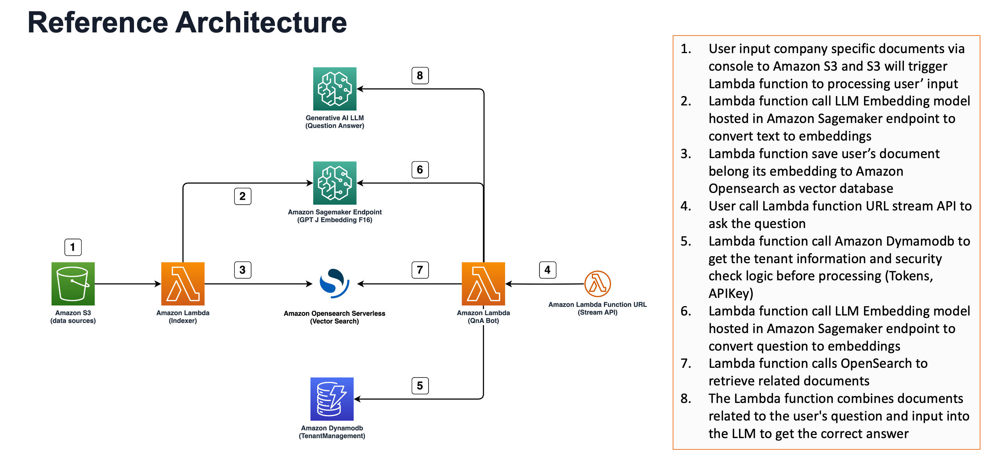
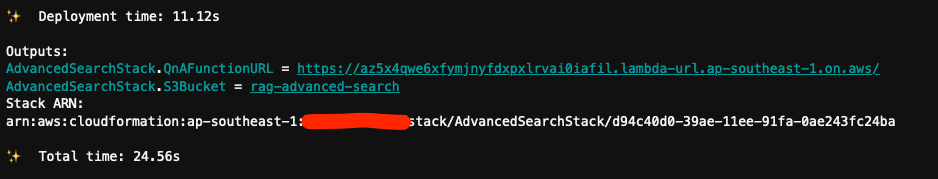
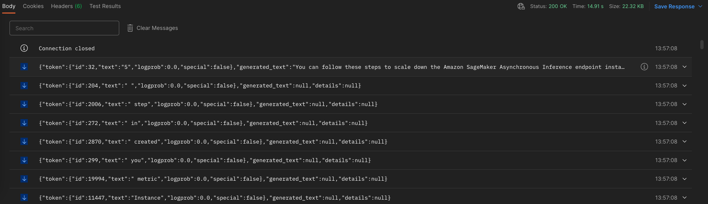

  

# AWS Sample: Stream inference LLM with AWS Lambda Stream URL

  

> This project is aimed to PoC the RAG solution and LLM stream response using AWS Lambda Stream URL & Opensearch Serverless as a Vector database. NOT Ready for production use!

## Architecture



## Setup

### 1. LLM deployment
Hosting LLM models to handle stream invocation is out scope this project. You can checkout another documents from AWS to know how to deploy the LLM to AWS Sagemaker Endpoint using Jumpstart or use the model via Bedrock.

- https://aws.amazon.com/bedrock/
- https://docs.aws.amazon.com/sagemaker/latest/dg/studio-jumpstart.html

### 2. Deploy to AWS with AWS CDK

 1. Install required tools
- Make sure you have [https://nodejs.org/en](nodejs) latest version and [python3.10](https://www.python.org/downloads/) is installed in your environment.
- AWS Opensearch Serverless creation by CDK is not ready yet. You can follow this guide to create it first. [Opensearch Serverless](https://docs.aws.amazon.com/opensearch-service/latest/developerguide/serverless-getting-started.html)
 2. Update environment variables
You can copy the `.env.sample` and rename it to `.env` and update the value according to your configurations

 3. Install dependencies and deploy to AWS with CDK
```bash
bash ./build_and_deploy.sh
```

Now we can see the output as the image below.
- QnAFunctionURL is the URL of the AWS Lambda Stream response and you can make the request to invoke streaming to your LLM
- S3Bucket is where you will input your raw data to building the vector knowledge database



 4. Now you can indexing data and invoke stream lambda URL with sample:

```curl
curl --location '<QnAFunctionURL>?q=How%20to%20scale%20down%20SageMaker%20Asynchronous%20endpoint%20to%20zero%3F' \
--header 'X-Amz-Date: xxx' \
--header <AWS Signature Auth>
```




---

## Thank you and happy learning! :rocket: