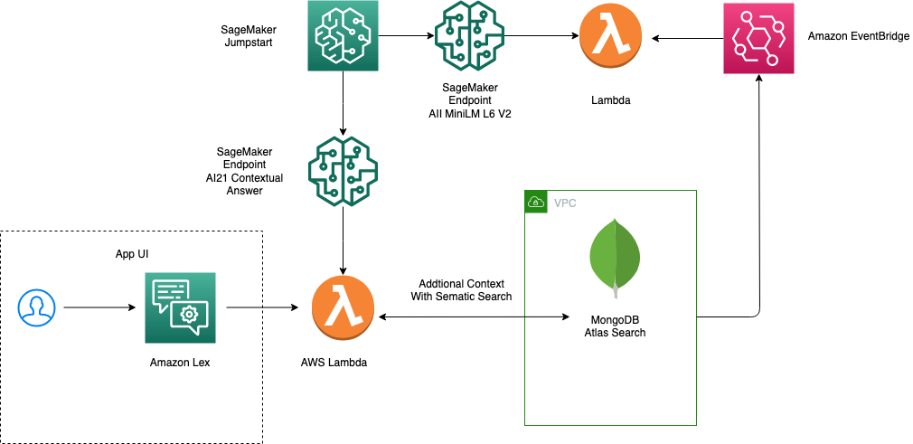

# Jumpstart Generative AI Examples

This repository contains code examples for SageMaker Jumpstart Generative AI, a tutorial series designed to help users get started with generative AI using Python and PyTorch.

## Module 1: Legal Document Summarization and Question Answering

    

In this module, you will learn how to perform short and long-form abstractive text summarization and question answering for legal documents. This module demonstrates a streamlined pipeline that combines three NLP tasks - abstractive text summarization, question generation, and answer generation via abstractive question answering. All of these tasks are accomplished using a single foundation model in a zero-shot setting with prompt engineering.

In this notebook we will demonstrate how to use **AI21 Contextual Answer** to answer questions using a library of documents as a reference, by using document embeddings and retrieval. The embeddings are generated from **All MiniLM L6 v2 embedding model** embedding model. 

## Usage
Each module has its own subdirectory containing code examples and instructions for use. Simply navigate to the module you are interested in and follow the instructions in the README file.